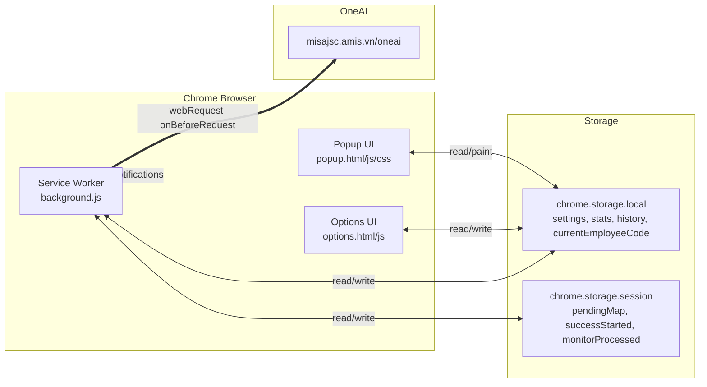
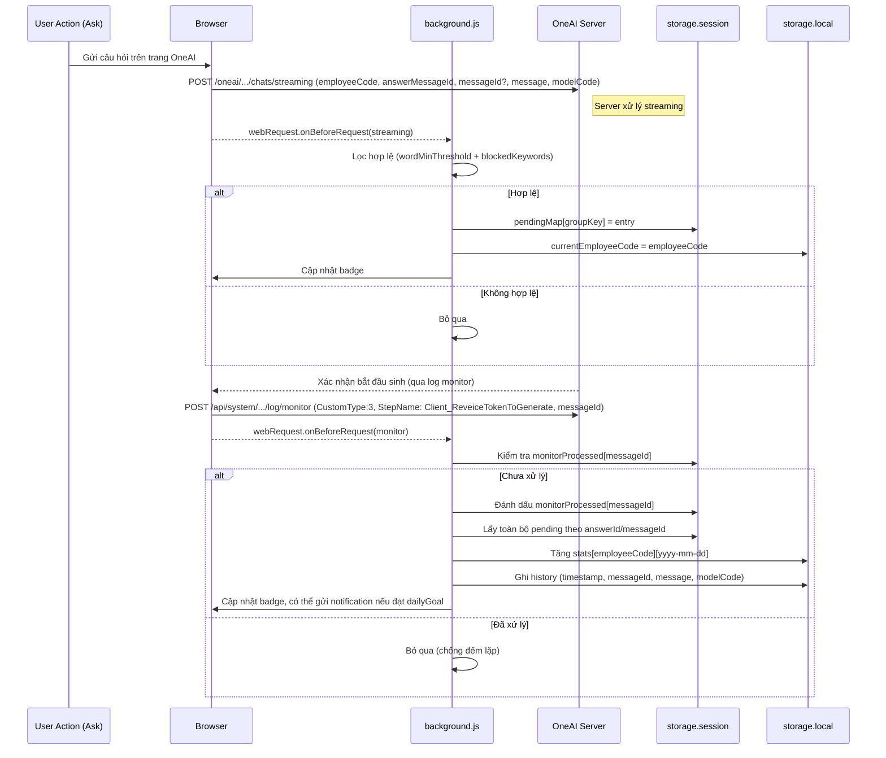

## OneAI Usage Tracker — Memory Bank (Tài liệu kỹ thuật cô đọng)

Mục tiêu: Nắm nhanh kiến trúc, luồng xử lý, lược đồ lưu trữ, UI và checklist kiểm thử/đóng gói của tiện ích Chrome MV3 theo dõi việc sử dụng OneAI tại `https://misajsc.amis.vn/oneai`.

### 1) Tổng quan kiến trúc
- Manifest V3, service worker: `background.js`
- Popup: `popup.html`, `popup.css`, `popup.js`
- Options: `options.html`, `options.js`
- Biểu tượng: `icons/`

#### Sơ đồ kiến trúc (Mermaid)

Quyền (manifest):
- `storage` (lưu cài đặt, thống kê, lịch sử)
- `webRequest` (bắt nội dung request và body)
- `alarms` (nhắc mỗi phút)
- `notifications` (hiển thị thông báo)
- `tabs` (mở tab OneAI khi bấm thông báo)
- `host_permissions`: `https://misajsc.amis.vn/*`

Phiên bản Chrome tối thiểu: 88. Action có popup, options page có sẵn.

### 2) Luồng ghi nhận “một lần sử dụng thành công” (2 bước)
1. Bắt request gửi câu hỏi: `.../oneai/.../chats/streaming`
   - Trích: `employeeCode`, `answerMessageId` (ưu tiên cho streaming), `messageId` (nếu có), `message`, `modelCode`.
   - Áp dụng lọc hợp lệ (xem mục 4). Nếu hợp lệ → lưu tạm entry (session) theo cặp ID (gộp `answerMessageId` và/hoặc `messageId`). Đồng thời cập nhật `currentEmployeeCode`.

2. Bắt request xác nhận: `.../api/system/*/log/monitor` với `CustomType: 3` và `StepName: "Client_ReveiceTokenToGenerate"`
   - Đọc `messageId` từ body monitor.
   - Chống xử lý lặp bằng map `monitorProcessed` (TTL 10 phút).
   - Tiêu thụ toàn bộ pending liên quan (từ session/memory), tăng thống kê theo ngày, ghi lịch sử chi tiết và cập nhật badge.

Cho phép “model đến muộn” trong 10 phút kể từ khi xác nhận (TTL `SUCCESS_TTL_MS`).

#### Sequence (Mermaid)

### 3) Lược đồ lưu trữ
- `chrome.storage.local`
  - `settings`: cấu hình người dùng (xem mục 4)
  - `stats`: { [employeeCode]: { [yyyy-mm-dd]: number } }
  - `history`: { [employeeCode]: { [yyyy-mm-dd]: Array<{ timestamp, messageId, message, modelCode }> } }
  - `currentEmployeeCode`: string | null

- `chrome.storage.session`
  - `pendingMap`: { [groupKey]: Array<{ employeeCode, createdAt, ids: { answerId?, requestId? }, message?, modelCode? }> }
  - `successStarted`: { [messageId]: number }  // timestamp xác nhận bắt đầu sinh
  - `monitorProcessed`: { [messageId]: number } // chống xử lý lặp monitor

Ghi chú: Ngoài session, còn giữ một buffer in-memory `memoryPending` để gom nhóm nhanh và tránh race điều kiện.

### 4) Luật lọc hợp lệ câu hỏi
Mặc định một câu hỏi bị coi là KHÔNG hợp lệ chỉ khi đồng thời:
- Số từ < `wordMinThreshold` (mặc định 5)
- Và chứa ít nhất một cụm trong `blockedKeywords` (mặc định: `cảm ơn`, `xin chào`, `tạm biệt`)

Hợp lệ → được ghi nhận khi có monitor bước 2.

### 5) Cài đặt (Options) và giá trị mặc định
DEFAULT_SETTINGS (tham khảo `background.js`/`options.js`):
- `wordMinThreshold`: 5
- `blockedKeywords`: ['cảm ơn','xin chào','tạm biệt']
- `alertsEnabled`: true
- `dailyGoal`: 6 (background) | 5 (UI có thể hiển thị/ghi khác; nên đồng bộ khi cần)
- `reminderTimes`: ['10:00','14:00','16:00','17:00'] (danh sách HH:MM)

Migration: hỗ trợ tự động chuyển `reminderHour`/`reminderHours` sang `reminderTimes` khi người dùng đang có cấu hình cũ.

### 6) Badge & Notifications
- Badge: hiển thị số lần của ngày hiện tại cho `currentEmployeeCode`. Màu nền: xanh khi đạt chỉ tiêu (`dailyGoal`), đỏ khi chưa.
- Nhắc nhở: nếu `alertsEnabled` và giờ:phút hiện tại trùng một mốc trong `reminderTimes`, sẽ kiểm tra số lần hôm nay; nếu < `dailyGoal`, hiển thị thông báo. Click thông báo mở `ONEAI_CHAT_URL`.

### 7) UI Popup (lịch theo tháng)
- Lưới thứ 2 → CN. Highlight cuối tuần, Today.
- Mỗi ô ngày hiển thị tổng count và trạng thái: `goal` (đạt), `below` (chưa), `na` (0 nhưng không thuộc trường hợp cần cảnh báo ở quá khứ ngày làm việc).
- Nhấn vào số sẽ hiển thị panel lịch sử ngày ở dưới: giờ, model, nội dung câu hỏi (có clamp/"Xem thêm").
- Toolbar: chuyển tháng trước/sau, quay về tháng hiện tại; nút xóa lịch sử cho tháng quá khứ.
- Nút Export: xuất lịch sử ngày hiện tại sang file HTML tự chứa, có style.

### 8) Options Page
- Bật/tắt cảnh báo, đặt `dailyGoal`.
- Nhập nhiều mốc `reminderTimes` dạng linh hoạt: `HH:MM`, `H:MM`, `HHhMM`, `HHh`, `HH`.
- Đặt `wordMinThreshold`, danh sách `blockedKeywords` (mỗi dòng một mục).

### 9) Xử lý ID và tránh đếm lặp
- Chìa khóa liên kết là `messageId` (từ monitor) + `answerMessageId`/`messageId` (từ streaming).
- Group key được tạo từ cặp ID đã sắp xếp, cho phép ghép khi chỉ có một trong hai ID ở một bước.
- `monitorProcessed` (session) chặn xử lý lặp nếu có nhiều request monitor cho cùng `messageId` trong 10 phút.

### 10) Edge cases & giới hạn
- Nếu popup/option đóng/mở không ảnh hưởng ghi nhận vì logic ở background.
- Nếu notification API lỗi (thiếu icon, giới hạn nền tảng), lỗi được bỏ qua an toàn.
- Nếu người dùng đổi `currentEmployeeCode` theo lần dùng mới, badge sẽ theo nhân viên mới nhất có hoạt động.
- Trường hợp không tìm thấy dữ liệu cho ngày/nhân viên → UI hiển thị "Không có bản ghi.".

### 11) Kiểm thử nhanh
1. Load unpacked thư mục dự án trong `chrome://extensions` (Dev mode).
2. Mở `https://misajsc.amis.vn/oneai`.
3. Thử các kịch bản:
   - Câu hỏi rất ngắn và chứa từ khóa chặn → không ghi nhận.
   - Câu hỏi ngắn nhưng không chứa từ khóa chặn → ghi nhận khi có monitor.
   - Câu hỏi dài hợp lệ → ghi nhận khi có monitor.
   - Kiểm tra badge đổi màu/đếm.
   - Thay đổi `reminderTimes`, `dailyGoal`, `wordMinThreshold`, `blockedKeywords` trong Options rồi thử lại.
   - Kiểm tra Export lịch sử ngày.

### 12) Bảo mật & Riêng tư
- Dữ liệu lưu cục bộ (`chrome.storage.local/session`), không gửi ra ngoài.
- Lịch sử gồm: thời điểm, `messageId`, `message` (câu hỏi), `modelCode` — cân nhắc người dùng tự chịu trách nhiệm nội dung lưu trên máy.

### 13) Debug & Bảo trì
- Mở DevTools của service worker (chrome://extensions → background của tiện ích) để xem `console.log` và network listeners.
- Kiểm tra `storage.local/session` bằng `chrome.storage` trong DevTools để xác thực lược đồ.

### 14) Đóng gói
- Đảm bảo `manifest.json` và icon đầy đủ; nén toàn bộ thư mục (trừ tệp tạm/thư mục build ngoài).
- Nếu phát hành công khai: bổ sung/chỉnh sửa `PRIVACY_POLICY.md`, mô tả cửa hàng, ảnh chụp màn hình và tài sản đồ họa theo yêu cầu.

