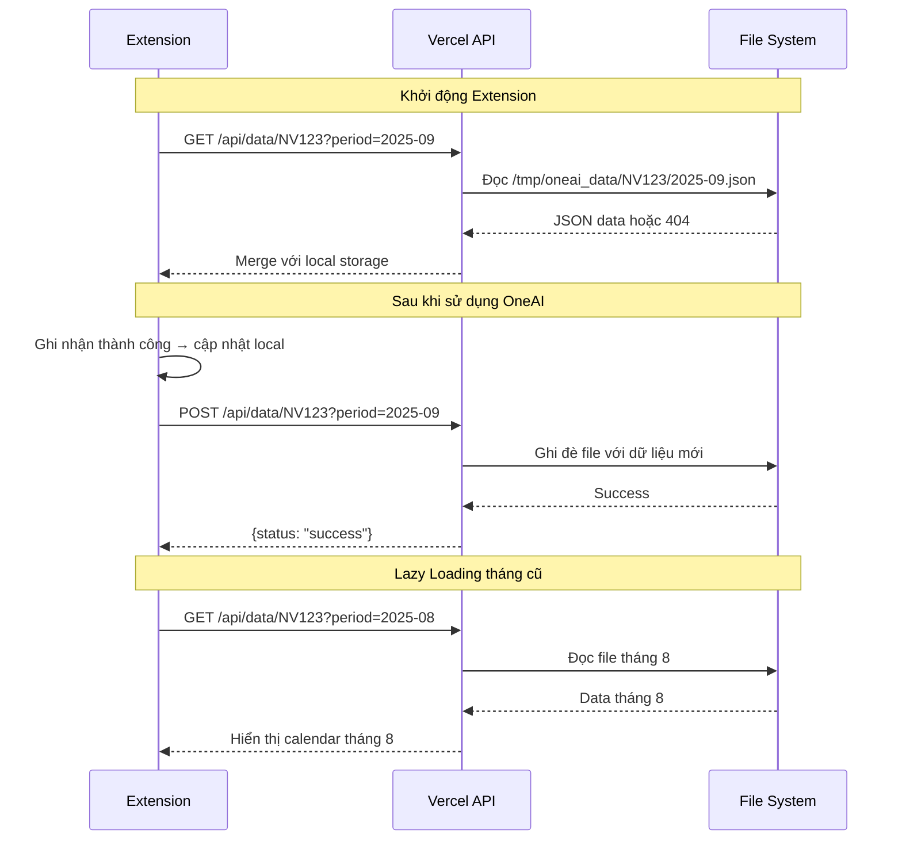

# OneAI Usage Tracker — Memory Bank (Tài liệu kỹ thuật)

Mục tiêu: Nắm nhanh kiến trúc, luồng xử lý, lược đồ lưu trữ, UI và đồng bộ API của tiện ích Chrome MV3 theo dõi việc sử dụng OneAI tại `https://misajsc.amis.vn/oneai`.

## 1) Tổng quan kiến trúc

### Cấu trúc project
```
OneAI-extension/
├── oneai-api/                    # API serverless Vercel
│   ├── api/index.js              # Express endpoints với CORS
│   ├── index.html                # Trang test API
│   ├── package.json              # Dependencies cho API
│   └── vercel.json               # Cấu hình Vercel deployment
├── oneai-extension/              # Chrome Extension (bản chính)
│   ├── background.js             # Service worker với đồng bộ API
│   ├── config.js                 # Cấu hình API endpoint
│   ├── manifest.json             # v1.1.0 với tính năng API sync
│   ├── popup.html/css/js         # UI calendar với lazy loading
│   ├── options.html/js           # Cài đặt
│   ├── icons/                    # Icons cho extension
│   └── README.md                 # Hướng dẫn chi tiết
└── oneai-extension-v1.1.2-final.zip  # Build cuối cùng
```

### Kiến trúc hệ thống
```mermaid
flowchart LR
  subgraph Browser[Chrome Browser]
    SW[Service Worker\nbackground.js]
    POP[Popup UI\npopup.html/js/css]
    OPT[Options UI\noptions.html/js]
    CFG[config.js\nAPI settings]
  end

  subgraph Storage
    L[chrome.storage.local\nsettings, stats, history, currentEmployeeCode]
    S[chrome.storage.session\npendingMap, successStarted, monitorProcessed]
  end

  subgraph API[Vercel API]
    APIE[/api/data/:employeeCode\nGET/POST với CORS]
    APIH[/api/health\nHealth check]
    APID[/api/debug\nEnvironment debug]
  end

  subgraph OneAI
    OA[misajsc.amis.vn/oneai]
  end

  POP <-- read/paint --> L
  POP -- lazy load --> SW
  OPT <-- read/write --> L
  SW <-- read/write --> L
  SW <-- read/write --> S
  SW == webRequest onBeforeRequest ==> OA
  SW == fetch API sync ==> APIE
  SW == alarms/notifications ==> Browser
  CFG -- config --> SW
```

### Quyền (manifest)
- `storage` (lưu cài đặt, thống kê, lịch sử)
- `webRequest` (bắt nội dung request và body)
- `alarms` (nhắc mỗi phút)
- `notifications` (hiển thị thông báo)
- `tabs` (mở tab OneAI khi bấm thông báo)
- `host_permissions`: `https://misajsc.amis.vn/*`

## 2) Luồng ghi nhận "một lần sử dụng thành công" (2 bước + API sync)

### Bước 1: Bắt request gửi câu hỏi
- Endpoint: `.../oneai/.../chats/streaming`
- Trích xuất: `employeeCode`, `answerMessageId`, `messageId`, `message`, `modelCode`
- Áp dụng lọc hợp lệ → lưu tạm entry (session) theo groupKey
- Cập nhật `currentEmployeeCode`

### Bước 2: Bắt request xác nhận
- Endpoint: `.../api/system/*/log/monitor`
- Điều kiện: `CustomType: 3` và `StepName: "Client_ReveiceTokenToGenerate"`
- Chống xử lý lặp bằng `monitorProcessed` (TTL 10 phút)
- Tiêu thụ pending, tăng stats, ghi history, cập nhật badge

### Bước 3: Đồng bộ API (Mới v1.1.0+)
- **Sau ghi nhận thành công**: Tự động POST dữ liệu tháng hiện tại lên server
- **Format gửi**: `{ stats: {YYYY-MM-DD: number}, history: {YYYY-MM-DD: Array<...>} }`

## 3) Đồng bộ dữ liệu với API

### API Endpoints
- **Base URL**: `https://one-ai-extension.vercel.app/api/data`
- **Authentication**: Header `X-Auth-Token: b75d8f44f4d54d1abf1d8fc3d1e0b9a3`
- **GET** `/api/data/:employeeCode?period=YYYY-MM`: Lấy dữ liệu tháng
- **POST** `/api/data/:employeeCode?period=YYYY-MM`: Lưu dữ liệu tháng
- **CORS**: Đã cấu hình `Access-Control-Allow-Origin: *`

### Luồng đồng bộ


### Các trigger đồng bộ
1. **onInstalled/onStartup**: Fetch tháng hiện tại từ server về local
2. **Sau ghi nhận thành công**: POST toàn bộ dữ liệu tháng hiện tại lên server
3. **Lazy loading**: Khi chuyển tháng trong popup, fetch nếu local chưa có

## 4) Lược đồ lưu trữ

### Local Storage
```javascript
// chrome.storage.local
{
  settings: {
    wordMinThreshold: 5,
    blockedKeywords: ['cảm ơn', 'xin chào', 'tạm biệt'],
    alertsEnabled: true,
    dailyGoal: 6,
    reminderTimes: ['10:00', '14:00', '16:00', '17:00']
  },
  stats: {
    "NV123": {
      "2025-09-18": 5,
      "2025-09-17": 3
    }
  },
  history: {
    "NV123": {
      "2025-09-18": [
        {
          timestamp: 1726653600000,
          messageId: "msg123",
          message: "Câu hỏi demo",
          modelCode: "gpt"
        }
      ]
    }
  },
  currentEmployeeCode: "NV123"
}
```

### Session Storage
```javascript
// chrome.storage.session
{
  pendingMap: {
    "groupKey": [{
      employeeCode: "NV123",
      createdAt: 1726653600000,
      ids: { answerId: "ans123", requestId: "req123" },
      message: "Câu hỏi",
      modelCode: "gpt"
    }]
  },
  successStarted: { "msg123": 1726653600000 },
  monitorProcessed: { "msg123": 1726653600000 }
}
```

### Server Storage (Vercel /tmp)
```
/tmp/oneai_data/
├── NV123/
│   ├── 2025-09.json
│   ├── 2025-08.json
│   └── ...
└── NV456/
    ├── 2025-09.json
    └── ...
```

**Format file JSON:**
```json
{
  "stats": {
    "2025-09-18": 5,
    "2025-09-17": 3
  },
  "history": {
    "2025-09-18": [
      {
        "timestamp": 1726653600000,
        "messageId": "msg123",
        "message": "Câu hỏi demo",
        "modelCode": "gpt"
      }
    ]
  }
}
```

## 5) Merge Strategy (Đồng bộ thông minh)

### Quy tắc merge
- **Stats**: Lấy giá trị lớn hơn giữa local và remote cho mỗi ngày
- **History**: Nối mảng local và remote (không dedupe phức tạp)
- **Conflicts**: Local luôn được ưu tiên khi có xung đột

### Code merge chính
```javascript
async function mergeMonthlyDataToLocal(employeeCode, period, remoteData) {
  const store = await chrome.storage.local.get([LOCAL_KEYS.stats, LOCAL_KEYS.history]);
  const stats = store[LOCAL_KEYS.stats] || {};
  const history = store[LOCAL_KEYS.history] || {};
  const userStats = stats[employeeCode] || {};
  const userHist = history[employeeCode] || {};
  const prefix = `${period}-`;

  // Merge stats: max giữa local và remote
  for (const [dayKey, cnt] of Object.entries(remoteData.stats || {})) {
    if (String(dayKey).startsWith(prefix)) {
      const localCnt = Number(userStats[dayKey] || 0);
      userStats[dayKey] = Math.max(localCnt, Number(cnt || 0));
    }
  }
  
  // Merge history: concat arrays
  for (const [dayKey, list] of Object.entries(remoteData.history || {})) {
    if (String(dayKey).startsWith(prefix)) {
      const localList = Array.isArray(userHist[dayKey]) ? userHist[dayKey] : [];
      const remoteList = Array.isArray(list) ? list : [];
      userHist[dayKey] = [...localList, ...remoteList];
    }
  }
}
```

## 6) Luật lọc hợp lệ câu hỏi

Một câu hỏi bị coi là **KHÔNG hợp lệ** chỉ khi đồng thời:
- Số từ < `wordMinThreshold` (mặc định 5)
- Và chứa ít nhất một cụm trong `blockedKeywords`

## 7) UI Features

### Popup Calendar
- **Lazy Loading**: Tự động fetch dữ liệu tháng nếu chưa có local
- **Color coding**: 
  - `goal` (xanh): Đạt chỉ tiêu
  - `below` (đỏ): Chưa đạt
  - `na` (xám): Không có dữ liệu
- **Export**: Xuất lịch sử ngày thành HTML

### Options Page
- Cấu hình `dailyGoal`, `reminderTimes`
- Điều chỉnh bộ lọc: `wordMinThreshold`, `blockedKeywords`

## 8) API Security

### Authentication
- **Method**: Shared secret trong header `X-Auth-Token`
- **Key**: `b75d8f44f4d54d1abf1d8fc3d1e0b9a3`
- **⚠️ Security Note**: Key nằm client-side, có thể bị lộ. Chỉ dùng demo/non-critical.

### CORS Configuration
```javascript
app.use((req, res, next) => {
  res.setHeader('Access-Control-Allow-Origin', '*');
  res.setHeader('Access-Control-Allow-Headers', 'Content-Type, X-Auth-Token');
  res.setHeader('Access-Control-Allow-Methods', 'GET,POST,OPTIONS');
  if (req.method === 'OPTIONS') return res.status(204).end();
  next();
});
```

## 9) Deployment & URLs

### Vercel Deployment
- **Production URL**: `https://one-ai-extension.vercel.app`
- **API Endpoints**: `/api/data/:employeeCode?period=YYYY-MM`
- **Test Page**: `/` (root)
- **Environment**: `API_SECRET_KEY` set trong Vercel UI

### URL Cố định
- Domain alias: `one-ai-extension.vercel.app` 
- Không thay đổi khi redeploy API
- Extension config trỏ vào URL cố định này

## 10) Version History

### v1.0.0 (Base)
- Tracking cơ bản với local storage
- Calendar UI và options
- Notification system

### v1.1.0 (API Sync)
- Thêm đồng bộ với Vercel API
- Lazy loading dữ liệu tháng cũ
- Auto sync sau mỗi lần sử dụng

### v1.1.2 (CORS Fix)
- Fix CORS cho Chrome Extension
- URL cố định với Vercel alias
- Production ready build

## 11) Development Workflow

### API Development
```bash
cd oneai-api
vercel dev          # Local development
vercel --prod --yes # Production deployment
```

### Extension Development
1. Load unpacked từ `oneai-extension/`
2. Test trên `https://misajsc.amis.vn/oneai`
3. Check DevTools service worker logs
4. Verify API calls trong Network tab

### Build & Package
```bash
# Build extension ZIP
Compress-Archive -Path "oneai-extension\*" -DestinationPath "oneai-extension-v1.1.2-final.zip" -Force
```

## 12) Troubleshooting

### Common Issues
1. **CORS Error**: Đảm bảo domain trong config.js khớp với production URL
2. **API 401**: Kiểm tra `API_SECRET_KEY` trong environment variables
3. **Data không sync**: Check network tab, verify endpoints

### Debug Endpoints
- **Health**: `/api/health` - API status
- **Debug**: `/api/debug` - Environment variables check
- **Test Page**: `/` - Manual API testing

## 13) Security Considerations

### Data Privacy
- Dữ liệu lưu local + server (Vercel /tmp)
- Message content được lưu trong lịch sử
- User tự chịu trách nhiệm về nội dung

### API Security
- Shared secret (có thể bị lộ client-side)
- Không dùng cho production critical
- Consider JWT/OAuth cho bảo mật cao hơn

## 14) Future Enhancements

### Possible Improvements
- JWT authentication thay shared secret
- Data encryption cho sensitive content
- Real-time sync với WebSocket
- Multi-user dashboard
- Analytics và reporting