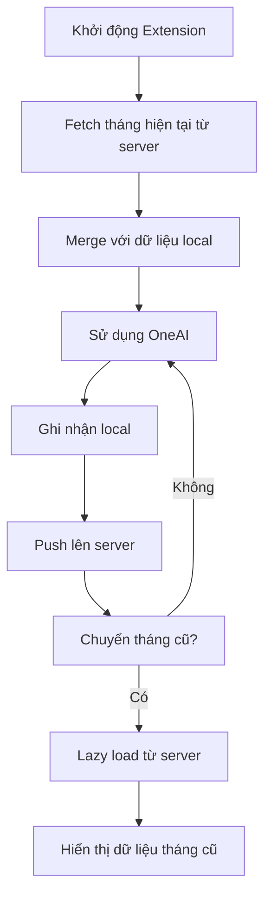

# OneAI Usage Tracker

Chrome Extension theo dõi và thống kê việc sử dụng OneAI với tính năng đồng bộ dữ liệu giữa các máy tính.

## 🌟 Tính năng chính

### Core Features
- ✅ **Tự động theo dõi** số lần sử dụng OneAI theo nhân viên và ngày
- ✅ **Lọc thông minh** tin nhắn dựa trên độ dài và từ khóa
- ✅ **Calendar view** hiển thị thống kê trực quan theo tháng
- ✅ **Xuất lịch sử** thành file HTML đẹp mắt
- ✅ **Thông báo nhắc nhở** đạt chỉ tiêu hàng ngày

### Đồng bộ dữ liệu (v1.1.0+)
- 🔄 **Auto sync** dữ liệu lên server sau mỗi lần sử dụng
- 📥 **Tải về tự động** khi khởi động extension trên máy mới
- ⚡ **Lazy loading** dữ liệu tháng cũ khi cần xem
- 🔀 **Merge thông minh** giữa dữ liệu local và server

## 🚀 Cài đặt nhanh

### Chrome Extension
1. Tải file `oneai-extension-v1.1.2-final.zip`
2. Giải nén ra thư mục
3. Mở Chrome → `chrome://extensions/`
4. Bật "Developer mode" (góc trên phải)
5. Chọn "Load unpacked" → chọn thư mục đã giải nén
6. Extension sẽ xuất hiện trên thanh công cụ

### Sử dụng
1. Truy cập https://misajsc.amis.vn/oneai/
2. Sử dụng OneAI bình thường
3. Extension tự động theo dõi và đồng bộ
4. Click icon extension để xem thống kê

## 🛠️ API & Đồng bộ

### API Endpoints
- **Base URL**: `https://one-ai-extension.vercel.app/api/data`
- **Test Page**: `https://one-ai-extension.vercel.app/`
- **Authentication**: Header `X-Auth-Token`

### Cấu trúc dữ liệu
```json
{
  "stats": {
    "2025-09-18": 5,
    "2025-09-17": 3
  },
  "history": {
    "2025-09-18": [
      {
        "timestamp": 1726653600000,
        "messageId": "msg123", 
        "message": "Câu hỏi demo",
        "modelCode": "gpt"
      }
    ]
  }
}
```

### Luồng đồng bộ


## 📊 Screenshots

### Calendar View

*Giao diện calendar với thống kê theo ngày*

### History Details  

*Chi tiết lịch sử sử dụng trong ngày*

### Options

*Trang cài đặt với các tùy chọn*

## ⚙️ Cấu hình

### Settings mặc định
```javascript
{
  wordMinThreshold: 5,           // Số từ tối thiểu
  blockedKeywords: [             // Từ khóa bị chặn
    'cảm ơn', 'xin chào', 'tạm biệt'
  ],
  alertsEnabled: true,           // Bật thông báo
  dailyGoal: 6,                 // Chỉ tiêu hàng ngày
  reminderTimes: [              // Giờ nhắc nhở
    '10:00', '14:00', '16:00', '17:00'
  ]
}
```

### Tùy chỉnh API
Sửa file `config.js` trong extension:
```javascript
export const API_BASE_URL = 'https://your-domain.vercel.app/api/data';
export const API_SECRET_KEY = 'your-secret-key';
```

## 🔧 Development

### Cấu trúc project
```
OneAI-extension/
├── oneai-api/                    # API serverless
│   ├── api/index.js              # Express endpoints
│   ├── index.html                # Test interface
│   └── vercel.json               # Deployment config
├── oneai-extension/              # Chrome Extension
│   ├── background.js             # Service worker
│   ├── config.js                 # API configuration
│   ├── popup.html/css/js         # UI components
│   └── manifest.json             # Extension manifest
└── oneai-extension-v1.1.2-final.zip  # Release build
```

### API Development
```bash
cd oneai-api
npm install
vercel dev                        # Local development
vercel --prod --yes              # Deploy production
```

### Extension Development
1. Load unpacked từ `oneai-extension/`
2. Sửa code → Reload extension
3. Test trên https://misajsc.amis.vn/oneai/
4. Check logs trong Service Worker DevTools

## 🚨 Bảo mật

### ⚠️ Quan trọng
- API secret key nằm trong extension (client-side) có thể bị lộ
- Chỉ dùng cho mục đích demo hoặc môi trường không quan trọng
- Để bảo mật cao, cần chuyển sang JWT hoặc OAuth

### Data Privacy
- Dữ liệu lưu local và sync lên server Vercel
- Nội dung tin nhắn được lưu trong lịch sử
- Người dùng tự chịu trách nhiệm về nội dung

## 📋 Changelog

### v1.1.2 (Current)
- ✅ Fix CORS cho Chrome Extension
- ✅ URL cố định với Vercel alias
- ✅ Production ready với đồng bộ ổn định

### v1.1.0  
- ✅ Thêm API đồng bộ với Vercel
- ✅ Lazy loading dữ liệu tháng cũ
- ✅ Auto sync sau mỗi lần sử dụng

### v1.0.0
- ✅ Tracking cơ bản với local storage
- ✅ Calendar UI và export HTML
- ✅ Notification system

## 🐛 Troubleshooting

### Lỗi thường gặp

**CORS Error**
```
Access to fetch at '...' has been blocked by CORS policy
```
→ Đảm bảo domain trong `config.js` khớp với production API

**API 401 Unauthorized**
```
{"error":"Unauthorized"}
```  
→ Kiểm tra `API_SECRET_KEY` trong Vercel environment variables

**Dữ liệu không sync**
→ Check Network tab trong DevTools, verify API endpoints

### Debug endpoints
- **Health check**: `/api/health`
- **Environment debug**: `/api/debug`  
- **Manual test**: Trang chủ API

## 🤝 Contributing

1. Fork repository
2. Tạo feature branch: `git checkout -b feature/amazing-feature`
3. Commit changes: `git commit -m 'Add amazing feature'`
4. Push branch: `git push origin feature/amazing-feature`
5. Open Pull Request

## 📄 License

MIT License - xem file [LICENSE](LICENSE) để biết chi tiết.

## 📞 Support

- **Issues**: [GitHub Issues](https://github.com/your-repo/issues)
- **Email**: your-email@domain.com
- **Docs**: [Memory Bank](MEMORY-BANK.md)

---

⭐ **Star this repo** nếu bạn thấy hữu ích!