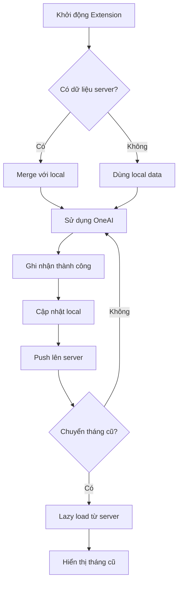

# OneAI Usage Tracker Extension v1.1.2

Chrome Extension theo dõi và đồng bộ việc sử dụng OneAI với API serverless.

## 🌟 Tính năng

### Core Tracking
- ✅ **Tự động theo dõi** số lần sử dụng OneAI theo nhân viên và ngày
- ✅ **Lọc thông minh** tin nhắn dựa trên độ dài và từ khóa chặn
- ✅ **Calendar view** hiển thị thống kê hàng tháng với color coding
- ✅ **Xuất lịch sử** thành file HTML tự chứa với styling đẹp
- ✅ **Thông báo nhắc nhở** đạt chỉ tiêu hàng ngày với multi-time support

### API Sync (v1.1.0+)
- 🔄 **Tự động đồng bộ** dữ liệu lên server sau mỗi lần sử dụng OneAI
- 📥 **Tải về tự động** khi khởi động extension (onInstalled/onStartup)
- ⚡ **Lazy loading** dữ liệu tháng cũ khi xem calendar
- 🔀 **Merge thông minh** giữa dữ liệu local và server (max cho stats, concat cho history)

## 🚀 Cài đặt

### Yêu cầu
- Chrome 88+ hoặc Edge Chromium
- Truy cập https://misajsc.amis.vn/oneai/

### Cài đặt Extension
1. **Giải nén** file `oneai-extension-v1.1.2-final.zip`
2. **Mở Chrome** → gõ `chrome://extensions/`
3. **Bật "Developer mode"** (toggle góc trên phải)
4. **Click "Load unpacked"** → chọn thư mục đã giải nén
5. **Extension xuất hiện** trên thanh công cụ với icon OneAI

### Sử dụng ngay
1. Truy cập https://misajsc.amis.vn/oneai/
2. Sử dụng OneAI bình thường (hỏi đáp)
3. Extension tự động ghi nhận và đồng bộ
4. Click icon extension để xem thống kê

## ⚙️ Cấu hình API

### API Endpoint (Đã cấu hình sẵn)
```javascript
// config.js
export const API_BASE_URL = 'https://one-ai-extension.vercel.app/api/data';
export const API_SECRET_KEY = 'b75d8f44f4d54d1abf1d8fc3d1e0b9a3';
```

### Thay đổi API Server
Nếu muốn dùng API server riêng, sửa file `config.js`:
1. Deploy API từ thư mục `../oneai-api/`
2. Cập nhật `API_BASE_URL` và `API_SECRET_KEY`
3. Reload extension

## 🎛️ Tùy chọn

### Settings Page
Truy cập: Click icon extension → Click ⚙️ Settings

**Cài đặt cơ bản:**
- **Daily Goal**: Chỉ tiêu số lần sử dụng mỗi ngày (mặc định: 6)
- **Enable Alerts**: Bật/tắt thông báo nhắc nhở

**Reminder Times:**
```
10:00    # 10 giờ sáng
14:00    # 2 giờ chiều  
16:00    # 4 giờ chiều
17:00    # 5 giờ chiều
```
Hỗ trợ format: `HH:MM`, `H:MM`, `HHhMM`, `HHh`, `HH`

**Bộ lọc tin nhắn:**
- **Word Threshold**: Số từ tối thiểu (mặc định: 5)
- **Blocked Keywords**: Từ khóa chặn, mỗi dòng một từ:
  ```
  cảm ơn
  xin chào  
  tạm biệt
  ```

### Logic lọc
Tin nhắn bị **loại bỏ** khi đồng thời:
- Số từ < Word Threshold
- VÀ chứa ít nhất 1 từ khóa chặn

## 📊 Giao diện

### Calendar View
**Layout:** Lưới 7x6 (Thứ 2 → Chủ nhật)

**Color coding:**
- 🟢 **Xanh**: Đạt chỉ tiêu (≥ dailyGoal)
- 🔴 **Đỏ**: Chưa đạt chỉ tiêu (< dailyGoal và là ngày làm việc quá khứ/hôm nay)  
- ⚫ **Xám**: Không có dữ liệu hoặc cuối tuần

**Navigation:**
- `◀` `▶`: Chuyển tháng trước/sau
- `Today`: Quay về tháng hiện tại
- `Clear Month`: Xóa lịch sử tháng quá khứ

### History Panel
Click vào **số lần sử dụng** trong ngày để xem chi tiết:

```
📅 Lịch sử (18/09/2025)

⏰ 09:30  🤖 gpt-4
Tôi muốn tìm hiểu về machine learning...
[Xem thêm]

⏰ 14:15  🤖 claude
Hãy giải thích khái niệm blockchain...  
[Thu gọn]
```

**Export:** Nút "Export Day" tạo file HTML đẹp với styling hoàn chỉnh

## 🔄 Đồng bộ dữ liệu

### Luồng sync tự động


### Merge Strategy
- **Stats**: Lấy giá trị lớn hơn giữa local vs server cho mỗi ngày
- **History**: Nối mảng local + server (không dedupe phức tạp)
- **Conflicts**: Local được ưu tiên khi có xung đột

### Data Format
```json
{
  "stats": {
    "2025-09-18": 5,    // Số lần sử dụng ngày 18/9
    "2025-09-17": 3
  },
  "history": {
    "2025-09-18": [
      {
        "timestamp": 1726653600000,
        "messageId": "msg_abc123", 
        "message": "Câu hỏi về AI...",
        "modelCode": "gpt-4"
      }
    ]
  }
}
```

## 🔒 Bảo mật & Privacy

### ⚠️ Quan trọng
- **API Secret** nằm trong extension (client-side) có thể bị lộ
- **Chỉ dùng** cho mục đích demo hoặc môi trường không quan trọng
- **Production**: Cần chuyển sang JWT hoặc OAuth

### Dữ liệu được lưu
- **Local**: `chrome.storage.local` - settings, stats, history
- **Server**: File JSON trên Vercel `/tmp/` - tự động sync
- **Content**: Câu hỏi gốc, thời gian, model code, message ID

### Quyền riêng tư
- Dữ liệu chỉ gửi tới API đã cấu hình
- Không chia sẻ với bên thứ ba
- Người dùng tự chịu trách nhiệm nội dung câu hỏi

## 🛠️ Development

### File Structure
```
oneai-extension/
├── background.js          # Service worker với API sync
├── config.js              # API configuration  
├── manifest.json          # Extension manifest v3
├── popup.html             # Calendar UI
├── popup.css              # Styling cho popup
├── popup.js               # Calendar logic + lazy loading
├── options.html           # Settings page
├── options.js             # Settings logic
├── icons/                 # Extension icons
│   ├── icon16.png
│   ├── icon32.png  
│   ├── icon48.png
│   └── icon128.png
└── README.md              # This file
```

### Key Components

**background.js:**
- Service worker (Manifest V3)
- WebRequest listeners cho OneAI endpoints
- Two-step success detection (streaming + monitor)
- API sync functions với error handling
- Badge management và notifications

**popup.js:**
- Calendar rendering với month navigation
- Lazy loading dữ liệu tháng cũ từ server
- History panel với expand/collapse
- Export functionality

**config.js:**
- API endpoint và secret key configuration
- Import/export cho background và popup

### Debug & Troubleshooting

**Extension DevTools:**
1. `chrome://extensions/` → OneAI Tracker → "service worker"
2. Xem Console logs và Network requests
3. Check `chrome.storage` trong Sources tab

**Common Issues:**
- **CORS Error**: Domain trong config.js không khớp
- **401 Unauthorized**: API secret key sai
- **Sync fails**: Network issues hoặc server down

## 📋 Changelog

### v1.1.2 (Current)
- ✅ Fix CORS cho Chrome Extension
- ✅ URL cố định với Vercel alias
- ✅ Production ready build

### v1.1.0
- ✅ Thêm API đồng bộ với Vercel
- ✅ Lazy loading tháng cũ
- ✅ Auto sync sau sử dụng

### v1.0.0  
- ✅ Core tracking functionality
- ✅ Calendar UI với export
- ✅ Options page với filters

## 🤝 Support

- **Main Project**: [../README.md](../README.md)
- **API Documentation**: [../oneai-api/README.md](../oneai-api/README.md)
- **Technical Details**: [../MEMORY-BANK.md](../MEMORY-BANK.md)
- **Changelog**: [../CHANGELOG.md](../CHANGELOG.md)

---

⭐ **Happy tracking!** Sử dụng OneAI hiệu quả với thống kê chi tiết.